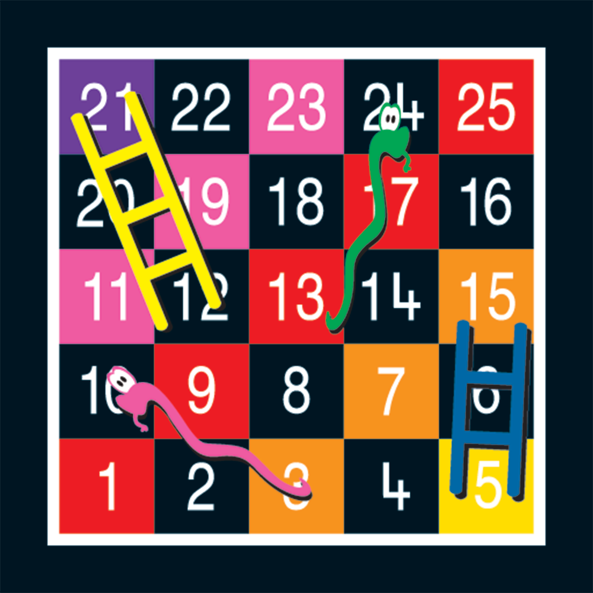

## Learning Compentencies
* Memahami konsep React dan React Native
* Mampu mengembangkan aplikasi React Native dari awal hingga akhir
* Mampu menggunakan komponen-komponen utama React Native
* Mengerti konsep dan penggunaan state management

## Summary
Dalam beberapa jam kedepan kamu akan membuat sebuah game sederhana dengan React Native, namanya Snakes and Ladders.

### ReleasesBerikut beberapa kriteria yang wajib diikuti:
1. HARUS menggunakan state management, boleh Redux atau MobX
2. HARUS MINIMAL memiliki tiga screen. Screen pertama adalah welcome screen. Welcome screen dapat digunakan untuk memulai permainan. Screen kedua adalah main screen yang merupakan screen utama tempat bermain. Dan screen terakhir adalah ketika sebuah permainan berakhir atau game over dan screen ini dapat digunakan untuk memulai permainan kembali.
3. HARUS menggunakan navigation untuk perpindahan screen.
4. DILARANG menggunakan UI framework seperti Native Base, React Native Element, Material Kit dan lain sebagainya.
5. HARUS melakukan commit sesering mungkin, minimal tiap 30 menit sekali.

Dan berikut adalah kriteria yang sifatnya tambahan:
1. DISARANKAN menggunakan ESLint. Semua error dan warning sebaiknya di fix terlebih dahulu.
2. DIPERBOLEHKAN menggunakan component styling library seperti [Glamorous](https://github.com/paypal/glamorous), [Styled Component](https://www.styled-components.com/), [Radium](https://formidable.com/open-source/radium/) atau yang lainnya.
3. Testing dengan JEST dengan coverage diatas 70% akan mendapatkan imbalan yang setimpal :slightly_smiling_face:

#### Release 0: The Board!

Buatlah sebuah board kosong yang memiliki ukuran 5x5 dan berikan label angka di setiap box-nya (urutan angka wajib mengikuti contoh gambar di atas). Bisa dimulai dengan membuat 3 screens dan board dengan data dummy di local state. Dan pastikan navigasi antar screen sudah berjalan lancar.
Kemudian lanjutkan dengan membuat komponen utama game berupa:
- Board Snakes and Ladders
- Definisikan beberapa state dari game
- Buatlah game agar bisa dimainkan oleh 2 player
NOTE: Untuk tampilan board, kamu bebas berkreasi untuk membuat design/warnanya

#### Release 1: Dice Roller
Buatlah logic untuk dice roll, angka yang dihasilkan dadu mempunyai range 1 sampai 6. Setiap player akan maju tergantung berapa jumlah dadu yang dihasilkan

#### Release 2: Add Snakes and Ladders
Tambahkan snakes dan ladders pada board kamu dan buatlah logic untuk menentukan ketika player berada di snake maka player akan turun, dan ketika player berada di ladder maka player akan naik. Untuk release ini, kamu bebas menentukan jumlah step naik/turun, jumlah maupun posisi snake/ladder

#### Release 3: Enter The Data
Setup Redux atau MobX dan pindahkan data dari local state ke state management.

#### Release 4: Game Over
Buatlah logic untuk mencari tahu kapan sebuah game akan berakhir.Ganbatte!! :fire::fire::fire:
styled-components.com